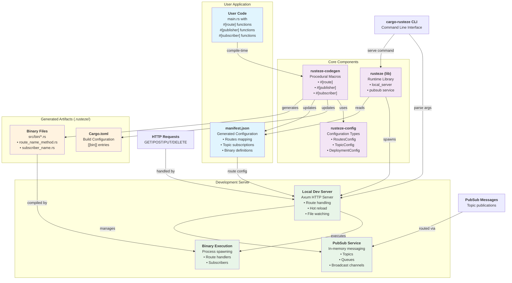
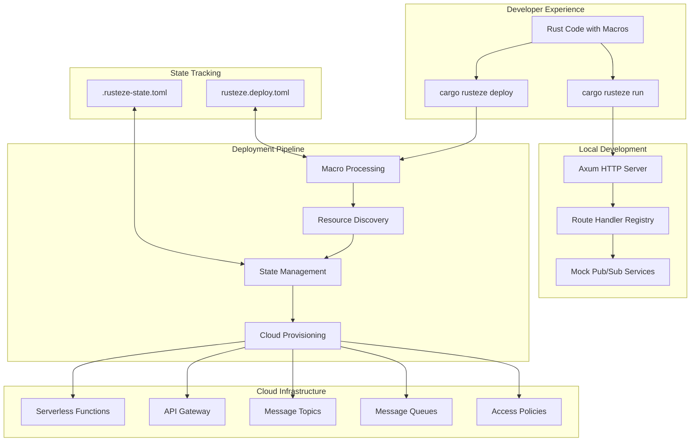

```mermaid
graph TB
    %% User Interface Layer
    CLI["`**cargo-rusteze CLI**
    Command Line Interface`"]

    %% Core Components
    subgraph "Core Components"
        CODEGEN["`**rusteze-codegen**
        Procedural Macros
        • #[route]
        • #[publisher]
        • #[subscriber]`"]

        CONFIG["`**rusteze-config**
        Configuration Types
        • RoutesConfig
        • TopicConfig
        • DeploymentConfig`"]

        LIB["`**rusteze (lib)**
        Runtime Library
        • local_server
        • pubsub service`"]
    end

    %% User Code
    subgraph "User Application"
        USERCODE["`**User Code**
        main.rs with
        #[route] functions
        #[publisher] functions
        #[subscriber] functions`"]

        MANIFEST["`**manifest.json**
        Generated Configuration
        • Routes mapping
        • Topic subscriptions
        • Binary definitions`"]
    end

    %% Generated Artifacts
    subgraph "Generated Artifacts (.rusteze/)"
        BINARIES["`**Binary Files**
        src/bin/*.rs
        • route_name_method.rs
        • subscriber_name.rs`"]

        CARGO_TOML["`**Cargo.toml**
        Build Configuration
        [[bin]] entries`"]
    end

    %% Runtime Components
    subgraph "Development Server"
        DEV_SERVER["`**Local Dev Server**
        Axum HTTP Server
        • Route handling
        • Hot reload
        • File watching`"]

        PUBSUB["`**PubSub Service**
        In-memory messaging
        • Topics
        • Queues
        • Broadcast channels`"]

        BINARY_EXEC["`**Binary Execution**
        Process spawning
        • Route handlers
        • Subscribers`"]
    end

    %% Flow connections
    CLI -->|serve command| LIB
    CLI -->|parse args| DEV_SERVER

    USERCODE -->|compile-time| CODEGEN
    CODEGEN -->|generates| BINARIES
    CODEGEN -->|updates| MANIFEST
    CODEGEN -->|updates| CARGO_TOML
    CODEGEN -->|uses| CONFIG

    LIB -->|reads| MANIFEST
    LIB -->|spawns| DEV_SERVER
    DEV_SERVER -->|manages| PUBSUB
    DEV_SERVER -->|executes| BINARY_EXEC

    MANIFEST -->|route config| DEV_SERVER
    BINARIES -->|compiled by| BINARY_EXEC

    %% External interactions
    HTTP_REQ["`**HTTP Requests**
    GET/POST/PUT/DELETE`"]
    PUBSUB_MSG["`**PubSub Messages**
    Topic publications`"]

    HTTP_REQ -->|handled by| DEV_SERVER
    PUBSUB_MSG -->|routed via| PUBSUB

    %% Styling
    classDef userCode fill:#e1f5fe
    classDef coreLib fill:#f3e5f5
    classDef generated fill:#fff3e0
    classDef runtime fill:#e8f5e8

    class USERCODE,MANIFEST userCode
    class CODEGEN,CONFIG,LIB coreLib
    class BINARIES,CARGO_TOML generated
    class DEV_SERVER,PUBSUB,BINARY_EXEC runtime
```

## State tracking

```mermaid
graph TB
    subgraph "Developer Experience"
        A[Rust Code with Macros] --> B[cargo rusteze run]
        A --> C[cargo rusteze deploy]
    end

    subgraph "Local Development"
        B --> D[Axum HTTP Server]
        D --> E[Route Handler Registry]
        E --> F[Mock Pub/Sub Services]
    end

    subgraph "Deployment Pipeline"
        C --> G[Macro Processing]
        G --> H[Resource Discovery]
        H --> I[State Management]
        I --> J[Cloud Provisioning]
    end

    subgraph "Cloud Infrastructure"
        J --> K[Serverless Functions]
        J --> L[API Gateway]
        J --> M[Message Topics]
        J --> N[Message Queues]
        J --> O[Access Policies]
    end

    subgraph "State Tracking"
        P[.rusteze-state.toml] <--> I
        Q[rusteze.deploy.toml] <--> G
    end
```
